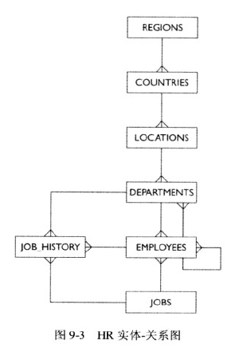

# SQL Select

投影projection、选择、联接这三个概念是SELECT语句功能的基础。

## 编写基本的 SQL SELECT 语句

- `SELECT`基本语法
- 查询当前用户所有用的表和视图
- 查看表的结构定义
- 查看表中所有数据
- 查看表中指定列的数据
- 显示某列唯一值
- SQL 语句中的加、减、乘、除
- NULL 的检索
- NULL 的计算
- SQL 连接符与单引号的使用
- Aslias 字段别名
- ||(连接符)应用
- `distinct` 删除重复值

## 演示模式 human_resources

HR实体-关系图

