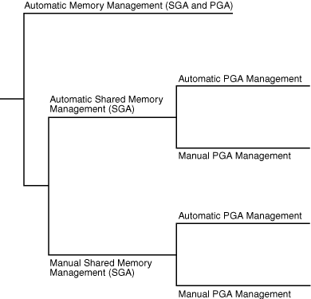

# Memory Architecture
内存结构

## 监控和管理内存

- 非默认标准块
- 使用多池
- 手动更改large_pool_size
- 将对象保存到内存中

## Memory Management Methods
内存管理

- 9i 自动化[PGA](Memory_PGA.md)管理
  - WORKAREA_SIZE_POLICY
  - PGA_AGGREGATE_TARGET
  - 内存颗粒
- 10g 自动化[SGA](Memory_SGA.md)管理, ASMM
  - SGA_TARGET
  - SGA_MAX_SIZE
- 11g 自动化内存管理, Automatic Memory Management, AMM
  - MEMORY_TARGET

