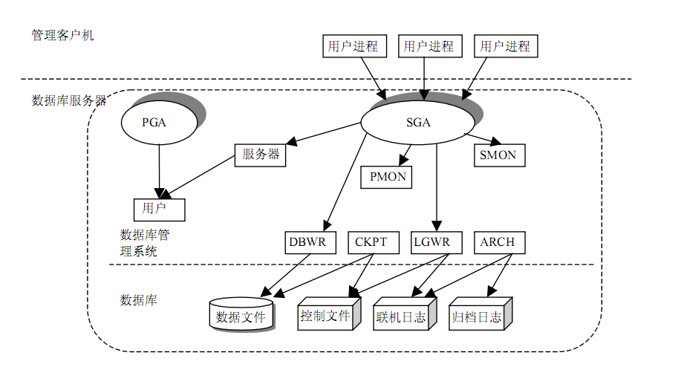

# Background Processes
后台进程

- General Processes(Important)
  - [CKPT](p_ckpt.md)
  - [DBWn](p_dbwn.md)
  - [LGWR](p_lgwr.md)
  - [PMON](p_pmon.md)
  - [SMON](p_smon.md)
  - [ARCH](p_arch.md)
- Others
  - [MMON](p_mmon.md)
  - [MMAN](p_mman.md)
  - [MMNL](p_mmnl.md)
  - [RECO](p_reco.md)
  - [GEN0](p_gen0.md)
  - [VKRM](p_vkrm.md)

[SQL-Demo-Processes](../../scripts/arch/instance_processes.sql)

## Reference

- [orafaq/wiki/Processes](http://www.orafaq.com/wiki/Database_Concepts_and_Architecture)