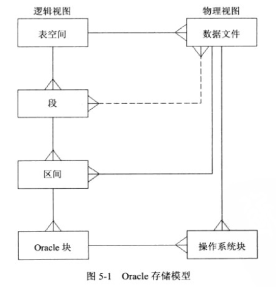

# Oracle Storage Structures
存储结构

- [Physical Storage Structures](#physical)
  - [Schema](Schema.md)
  - [Database Files](#database-files)
    - Control Files
    - Data Files
    - Online Redo Log
    - [Other Files](#other-files)
  - [Oracle ASM](asm/ASM.md)
  - 可插拔数据库(PDB)(12c)
  - 块变化跟踪文件
  - Flashback日志
  - RMAN backups
- [Logical Storage Structures](#logical)
  - Tablespace
  - Segment
  - Extent
  - Data Blocks
- [Others](#others)
- [Reference](#reference)

## Database Files
数据库文件

[SQL-Demo-db-files](../../scripts/arch/storage_db_files.sql)

### Control Files
控制文件 control.ctl

多路复用控制文件(multiplexing the controlfile)
如，所有生产数据库将把三个控制文件副本放在三个独立设备上。

最多可有8个控制文件的多路复用副本。

### Data Files
数据文件 tablespacename.dbf

服务器进程对数据文件执行读操作，而 **DBWn** 对数据文件执行写操作。

### Online Redo Log
联机Redo日志文件 redo.log

就每个数据库而言，要保证其正常运行，至少必须有两个联机重做日志文件组；
要保证安全，每组至少要有两个成员。

- log writer (LGWR)

### Other Files

- Instance Parameter File, 实例参数文件
  - [pfile/spfile](../../mgmt/Instance/Instance.md)
- Password File, 口令文件
- Archive Redo Log Files, 归档重做日志文件
- Alert Log and Trace Files, 警报日志和跟踪文件

## Logical
逻辑结构

### Tablespace
表空间

- 表空间将逻辑数据存储(段)从物理数据存储(数据文件)中抽象出来。
- 表空间可由多个数据文件组成。
- 元数据作为一组段存储在SYSTEM和SYSAUX表空间。

[SQL-Demo-Tablespace](../../scripts/arch/storage_tablespace.sql)

OMF, Oracle-Managed Files

> 表空间类型

- SMALLFILE

可以具有多个文件，而且所有数据文件都可以向上重调

- BIGFILE

只能有一个文件

### Segment
段

- 一个段可以包含位于多个数据文件的区间。
- 一个段包含多个区间，一个区间包含多个Oracle块，一个Oracle块包含多个操作系统块。

[SQL-Demo-Segment](../../scripts/arch/storage_segment.sql)

### Extent
区

一个区间是位于一个数据文件的多个连续块。

### Data Blocks
块

一个Oracle块是一个或多个操作系统块。

Oracle块是数据库的基本I/O单元。

## Others

- 管理方案对象
  - 分区表
  - 索引组织表
  - 簇
  - 联机重组
- 管理存储
  - 表空间监视
  - 段收缩
  - 恢复挂起语句
  - 传输表空间
  - 平台传输数据库

## Reference

- [Data Blocks](https://docs.oracle.com/cd/E11882_01/server.112/e40540/logical.htm#CNCPT302)